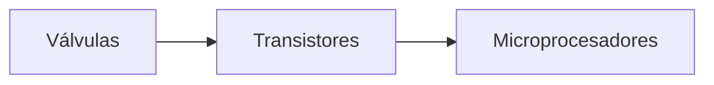

# Introducción redes de computación

## Evolución de las redes de computadoras

- Para transferir datos de un computador a otro se usaban elementos de almacenamiento físico.

- El día de hoy se usan redes para facilitar el procesamiento de datos.

## Qué es una red?

Es un conjunto de computadores autónomos interconectados.

Las aplicaciones de una red son:

- Compartir recursos (información).

- Proveer la confiabilidad: más de una fuente para los recursos.

- Escalabilidad de los recursos computacionales.

- Comunicación.

**<mark>Nota:</mark>**

Un **mainframe** es un servidor que se usa para el procesamiento de datos.

Una **red** es un grafo conformado por elementos llamados nodos.

# Tipos de Redes

### Según su extensión

1. **LAN:** Red Local Network
   
   - Privadas
   
   - Tecnología cableada
   
   - Distancia 10m - 10km
   
   Para armar una red LAN alámbrica se necesita un **switch** donde se puedan conectar los elementos.
   
   

2. **MAN:** Metropolitan Area Network
   
   - Conjunto de LAN's
   
   - Distantes, muchos kilometros
   
   - Infraestructura de los operadores o soluciones de enlace de datos.

3. **WAN:** Wide Area Network
   
   Conexión de nodos o LAN's a grandes distancias.

Las **redes inalámbricas** son radios, microondas, infrarojos o cualquier forma de transmisión que emplee aire.

## Consideraciones en una red de computadores

Se tiene que tener en cuenta que la transmisión de datos en una red viene dada por dos elementos importantes a tener en cuenta que son los **mensajes** y las **velocidades** de transmisión.

#### Mensajes:

La fómula que relaciona el tamaño del mensaje $x$ con velocidad de transmisión es:

$$
v = \frac{x}{t}

$$

| Bits      | Bytes  |
|:---------:|:------:|
| 8 bits    | 1 byte |
| 1024 bits | 1 kb   |
| 1024 kb   | 1mb    |

#### Velocidades:

Viene representado con las unidades $bit/seg$ .

| 1000 bps | 1kbps       |
|:--------:|:-----------:|
| 1000kbps | 1mbps       |
| 1mbps    | 1000000 bps |

**Paquetización de la información:** Los paquetes o mensajes que se envían son divididos en tramas, las tramas con un paquete el cual tiene una parte de la información original y otra parte que representa un espacio adicional.

$$
x = n \cdot p_{bits}
$$

$n$ reprensenta la cantidad de paquetes o tramas que se van a transportar.

$$
t = \frac{n \cdot (p+h)}{v}
$$

$h$ representa los bits adicionales de cada trama.

# Topologías

Una topología es el aspecto que tiene una red, es decir, su distribución geométrica para que fluyan los datos entre nodos.

### Según su topología

1. **Red de difusión:** Topologías propias de las redes LAN.
   
   

2. **Red punto a punto:** Propias de las redes MAN y WAN.
   
   

# Protocolos de comunicación

Para interconectar dos o más estaciones es necesario establecer una conexión física sea por cable o cualquier otro medio. Es importante tener una conexión lógica.

Un protocolo es un conjunto de reglas y estados para la comunicación entre estaciones.

**Modelo de arquitectura por capas**

En los niveles de cada capa existe un protocolo. 

Los aspectos del **diseño de las capas** son: 

- Direccionamiento

- Control de errores

- Control de flujo

- Tipo de conexión

- Enrutamiento

Una red tiene que velar por el control de flujo.

Existen nodos con caracteristicas propias (sotfware y hadware).

Un emisor rápido frente a un emisor lento no debe desbordar y viceversa. Debe existir un equilibrio en la comunicación.

**<mark>Nota:</mark>** 

Una LAN que se quiere conectar con otra LAN puede haber un intermedio de un **enrutador o router**.

 El tipo de conexión puede ser clasificado en dos: 

- **Orientada:** Los paquetes llegan mayormente en orden.
  
  - Encuentra su modelo en el sistema telefónico.
  
  - El usuario del servicio establece primero una conexión, la usa y después la libera. 
  
  - Una conexión actúa como un tubo o canal sellado: el emisor empuja datos por un extremo y el receptor los saca en el mismo orden por el otro extremo.

- **No - Orientada:** Información conectada a la red.
  
  - Toma su modelo del correo postal.
  
  - Cada mensaje lleva la dirección completa de destino, y cada uno se encamina a través del sistema en forma independiente a todos los demás.

### Jerarquía de protocolos

### Encapsulamiento de datos

# Modelos de Referencia

Relación entre servicio y protocolo:

 Hay dos modelos de referencia destacados que son el OSI y el TCP/ID.

## Modelo de referencia OSI (Interconexión de sistemas abiertos)

Modelo basado en la propuesta por la ISO (Organización internacional de estándares).

El sistema de referencia OSI tiene 7 capas. 

1. Una capa se crea por cada abstracción diferente.

2. Cada capa tiene una función.

3. Las funciones se definen teniendo en cuenta los protocoloes estandarizados.

4. Los límites se minimizan, el flujo entre las interfaces debe ser el mínimo.

5. Capa grandes para no agrupat distintas funciones en una capa.

6. Capas pequeñas para que la arquitectura no se vuelva inimaginable.

### Descripción de cada capa

#### Capa Física

Transmisión de bits a través de un canal de comunicación.

- Se define el tipo de conector utilizado, números de alambres y sus funciones.

- Representación de los bits

- Interfaces mecánicas y eléctricas

### Capa de enlace de datos

Transformar el medio de transmisión en una línea de comunicación. Para que los datos lleguen sin errores a una línea superior.

- Se necesita un mecanismo de regulación de tráfico para **no saturar los datos**.

- Entramado.

- Control de flujo.

- Control de errores.

- Direccionamiento físico.

### Capa de red

Su **función más importante** es el nrutamiento y direccionamiento lógico.

- Entrega de paquetes del origen al destino a través de múltiples subredes (enlaces).

- Si dos sistemas están conectados al mismo enlace no es necesario el nivel de red.

- Si están conectados a enlaces diferentes es necesario el nivel de red.

- La capa de red tiene que hacerse responsable de los errores que puedan surguir debido a direccionamiento, protocoloes diferentes... (casos de redes **heterogéneas**)

### Capa de transporte

La función de la capa de transporte es aceptar datos del nivel de sesión y dividirlos en unidades más pequeñas (segmentos). pasarlos a la capa de red y asegurar que todos los fragmentos lleguen correctamente y en orden al otro extremo.

- Entrega ****origen-destino**** (extremo a extremo) de todo el mensaje.

- Control de conexión: Orientado y No Orientado.

- Control de flujo y errores de extremo a extremo.
  
  

El tipo de canal-conexión de transporte más popular es un canal **punto a punto** libre de errores que entrega mensajes o bytes en el orden en el que se recibieron.

<mark>Nota:</mark> Las capas superiores se relacionan solo con protocolos (enfoque de software). Las capas inferiores operan entre máquinas y sus vecinos.

### Capa de sesión

Permite que las máquinas diferentes establezcan sesiones entre ellos. Se le denomina **control de diálogo**, el diálogo puede ser Semi-duplex o Full-duplex.

- Sincroniza la comunicación entre sistemas de comunicación.

- Administración de token. Impide que dos máquinas realicen una misma acción.

### Capa de presentación

Sintaxis o semática de la información transmitida. Pra que distintas computadoras con diferente representación se comuniquen.

Las estructuras de datos que se intercambian son **abstractas**. 

- Convierte la sarta de caracteres a bits.

- Asegura la privacidad de la información.

- Compresión: reduce el número de bits a transmitir.

### Capa de aplicación

En este nivel el se definen los protocolos para que las aplicaciones se comuniquen por la red. Existen estándares en este nivel que permiten la comunicación entre aplicaciones diseñadas por diferentes programadores.

## Modelo de referencia TCP/IP

Comparación entre modelo de referencia OSI y TCP/IP.

# Métodos de Transmisión

1. **Unicast:**  Único paquete de datos enviado desde el origen a un único nodo destino en la red, así:
   • El nodo origen envía el paquete usando la dirección del nodo destino.
   • El paquete se envía en la red.
   • La red pasa el paquete al dispositivo destino.

2. **Multicast:**  La transmisión multicast consiste en un único paquete que se copia y envía a un subconjunto específico de nodos en la red, así:
   • El nodo origen direcciona el paquete usando una dirección multicast.
   • El paquete se envía en la red.
   • La red hace copias del paquete.
   • Una copia del paquete se envía a cada nodo que es parte de la dirección multicast.

3. **Broadcast:**  Las transmisiones broadcast consisten en un único paquete de datos
   que se copia y envía a todos los nodos de la red, así:
   • El nodo origen direcciona el paquete usando la dirección broadcast.
   • El paquete se envía en la red.
   • La red hace copias del paquete.
   • Una copia del paquete se envía a todos los nodos de la red.

